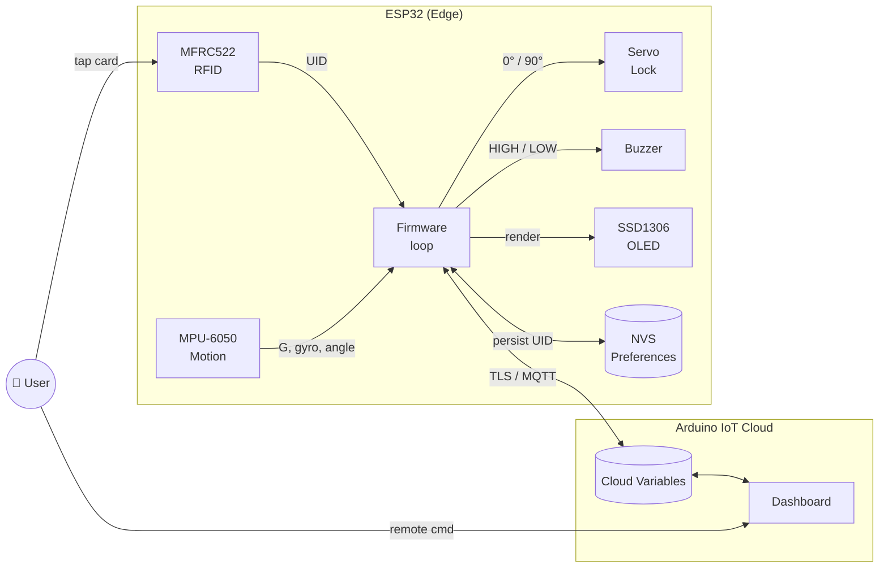
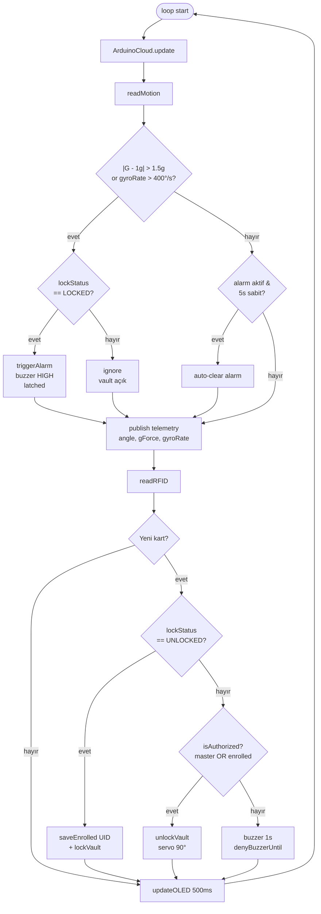
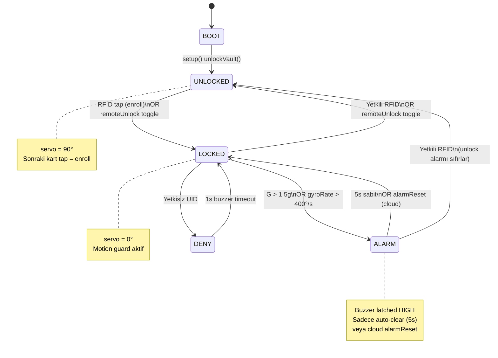

# 🔐 SecureIoT Transit Vault

> ESP32 tabanlı, RFID kimlik doğrulamalı, fiziksel tamper-alarmlı ve Arduino IoT Cloud üzerinden uzaktan kontrol edilebilen taşınabilir akıllı kasa.


---

## 📑 İçindekiler

- [Genel Bakış](#-genel-bakış)
- [Kullanım Senaryoları](#-kullanım-senaryoları)
- [Sistem Mimarisi](#-sistem-mimarisi)
- [Veri Akış Şeması](#-veri-akış-şeması)
- [Durum Diyagramı](#-durum-diyagramı)
- [Donanım](#-donanım)
- [Pin Bağlantıları](#-pin-bağlantıları)
- [Teknik Özellikler](#-teknik-özellikler)
- [Kurulum](#-kurulum)
- [Kullanım](#-kullanım)
- [Cloud Değişkenleri](#-cloud-değişkenleri)
- [Güvenlik Notu](#-güvenlik-notu)
- [Lisans](#-lisans)

---

## 🎯 Genel Bakış

**SecureIoT Transit Vault**, taşıma sırasında içeriğin fiziksel bütünlüğünü koruyan ve uzaktan izlenebilen bir IoT kasa firmware'idir. Üç katmanlı bir savunma sunar:

| Katman | Mekanizma | Bileşen |
|---|---|---|
| 🪪 Kimlik | RFID UID eşleşmesi (MASTER + NVS-persisted) | MFRC522 |
| 📐 Fiziksel | Darbe & ani rotasyon tespiti | MPU-6050 |
| ☁️ Uzaktan | Cloud unlock / alarm reset / UID enroll | Arduino IoT Cloud (TLS) |

**Kapatılan IoT zafiyetleri:**

- ❌ Hardcoded tek-faktör auth → ✅ NVS persist + cloud-tarafı UID enroll
- ❌ Local-only alarm reset (fiziksel saldırgan susturur) → ✅ Latching alarm, sadece cloud `alarmReset` veya 5 sn sabitlik
- ❌ Açıkta kalan sensör verisi → ✅ Cloud TLS üzerinden telemetri
- ❌ Power-loss durumunda yetki kaybı → ✅ ESP32 NVS (`Preferences`) ile kalıcı UID

---

## 💼 Kullanım Senaryoları

| Senaryo | Fayda |
|---|---|
| 🚚 Değerli kargo taşıma | Yol boyunca darbe / eğim eventleri cloud'a yansır |
| 🏥 Numune / ilaç transferi | Mekanik stres trace edilir; UID ile yetki kontrolü |
| 🏠 Akıllı ev gizli kasa | RFID + uzaktan unlock; alarm telefona gelir |
| 🏭 Endüstriyel saha kit kutusu | Yetkili teknisyen kartı + uzaktan denetim |
| 🎒 Kişisel veri / cüzdan kasası | Düşük maliyetli, açık kaynak |

---

## 🏗 Sistem Mimarisi



---

## 🔄 Veri Akış Şeması



---

## 🎛 Durum Diyagramı



---

## 🔧 Donanım

| Bileşen | Model | Arayüz |
|---|---|---|
| MCU | ESP32 DOIT DevKit V1 | — |
| RFID | MFRC522 | SPI (özel pinler) |
| Motion | MPU-6050 | I2C @ 0x68 |
| Display | SSD1306 128×64 OLED | I2C @ 0x3C |
| Actuator | SG90 / MG90 servo | PWM |
| Alarm | Aktif buzzer 5V | GPIO |

> ⚠️ **Not:** Bu kartta GPIO23 hatalı. SPI MOSI **GPIO32**'ye yönlendirildi.

---

## 🔌 Pin Bağlantıları

| Periferik | Sinyal | ESP32 GPIO |
|---|---|---|
| OLED SSD1306 | SDA | 21 |
| OLED SSD1306 | SCL | 22 |
| MPU-6050 | SDA / SCL (paylaşımlı) | 21 / 22 |
| RFID MFRC522 | SS | 5 |
| RFID MFRC522 | SCK | 14 |
| RFID MFRC522 | MOSI | 32 |
| RFID MFRC522 | MISO | 25 |
| RFID MFRC522 | RST | 4 |
| Servo | Signal | 13 |
| Buzzer | Signal | 12 |

**Güç:** OLED / MPU / RFID = **3V3** · Servo / Buzzer = **5V** · Ortak GND.

---

## ⚙️ Teknik Özellikler

| Parametre | Değer |
|---|---|
| Dinamik G eşiği | `1.5 g` (sapma: `‖a‖ − 1g`) |
| Açısal hız eşiği | `400 °/s` (gyro X ekseni) |
| Açı dead-zone filtresi | `0.3 °` (gyro drift bastırma) |
| Alarm auto-clear süresi | `5000 ms` sabit MPU |
| OLED yenileme sıklığı | `500 ms` |
| RFID debounce | `1000 ms` |
| Telemetri publish | `1000 ms` |
| UID kalıcılığı | ESP32 NVS — `Preferences(vault, uid)` |
| Auth modeli | Master UID (compile-time) + 1 enrolled UID (runtime) |
| Cloud transport | Arduino IoT Cloud — MQTT over TLS 1.2 |
| Baseline reset | `lockVault()` çağrısı veya `statsReset` cloud tetiği |
| Servo konumları | `0°` = LOCKED · `90°` = OPEN |

---

## 🚀 Kurulum

### 1. Kütüphaneler (Arduino Library Manager)

| Kütüphane | Sürüm |
|---|---|
| Adafruit SSD1306 | 2.5.10 |
| Adafruit GFX Library | 1.11.9 |
| MFRC522 | 1.4.10 |
| MPU6050_tockn | 1.0.2 |
| ESP32Servo | 0.13.0 |
| ArduinoIoTCloud | Arduino Cloud üzerinden |
| Arduino_ConnectionHandler | Arduino Cloud üzerinden |

### 2. Repo'yu klonla

```bash
git clone https://github.com/<kullanici>/SecureIoT_Transit_Vault.git
cd SecureIoT_Transit_Vault
```

### 3. `arduino_secrets.h` dosyasını oluştur

Bu dosya `.gitignore`'da — repoda **bulunmaz**, her geliştirici kendisi oluşturur.

Proje kök dizininde `arduino_secrets.h` adında yeni dosya oluştur:

```cpp
#define SECRET_SSID          "WiFi-Ağ-Adı"
#define SECRET_OPTIONAL_PASS "WiFi-Şifresi"
#define SECRET_DEVICE_KEY    "Arduino-Cloud-Device-Key"
```

**Değerleri nereden bulursun:**

| Define | Kaynak |
|---|---|
| `SECRET_SSID` | Bağlanacağın WiFi ağının adı |
| `SECRET_OPTIONAL_PASS` | WiFi şifresi (açık ağ ise boş bırak: `""`) |
| `SECRET_DEVICE_KEY` | [Arduino Cloud](https://app.arduino.cc/) → Devices → cihazın → Secret Key |

### 4. Arduino IDE 2.x ile yükle

1. **Tools → Board** → *DOIT ESP32 DEVKIT V1*
2. **Tools → Port** → ESP32 USB portu seç
3. `SecureIoT_Transit_Vault.ino` dosyasını aç
4. **Upload** (→)

### 5. Master UID'yi güncelle (opsiyonel)

```cpp
// SecureIoT_Transit_Vault.ino satır 44
const String MASTER_UID = "B9 2A 2D 40";  // kendi kartınla değiştir
```

**UID okuma:** Serial Monitor'ü **115200 baud** aç → kart okut → `[RFID] Card UID:` satırını kopyala.

---

## 🕹️ Kullanım

### Fiziksel (yerel)

| Eylem | Sonuç |
|---|---|
| Boot | Kasa **UNLOCKED** durumda başlar |
| UNLOCKED iken kart okut | Kart **enroll** edilir → kasa **LOCK** |
| LOCKED iken yetkili kart | **UNLOCK** + alarm sıfırlanır |
| LOCKED iken yetkisiz kart | 1 saniye buzzer → DENY |
| LOCKED iken darbe / ani rotasyon | **ALARM** (buzzer latched) |
| 5 sn boyunca hareketsiz | Alarm otomatik kapanır |

### Uzaktan (Arduino IoT Cloud Dashboard)

| Değişken | Tip | Eylem |
|---|---|---|
| `remoteUnlock` | bool toggle | Kilit durumunu çevirir + alarm sıfırlar |
| `alarmReset` | bool toggle | Latched buzzer'ı durdurur |
| `authorizedUidInput` | String | Yeni enrolled UID gir (kasa LOCKED iken) |
| `statsReset` | bool toggle | Hareket istatistiklerini sıfırlar, baseline günceller |

**`authorizedUidInput` desteklenen UID formatları:**

```
A1B2C3D4
a1:b2:c3:d4
A1 B2 C3 D4
```

4 / 7 / 10 byte (8 / 14 / 20 hex karakter) kabul edilir; geçersiz format sessizce reddedilir.

---

## ☁️ Cloud Değişkenleri

| Değişken | Yön | Tip | Açıklama |
|---|---|---|---|
| `angle` | R | float | Filtreli ivmemetre tabanlı X açısı (°) |
| `gForce` | R | float | Dinamik sarsıntı: `‖a‖ − 1g` |
| `gyroRate` | R | float | Anlık açısal hız `|gyro X|` (°/s) |
| `lockStatus` | R | bool | `true` = UNLOCKED |
| `rfidUID` | R | String | Son okunan kart UID |
| `remoteUnlock` | RW | bool | Rising edge → kilit toggle |
| `alarmReset` | RW | bool | Rising edge → buzzer kapat |
| `authorizedUidInput` | RW | String | Cloud üzerinden kart enroll |
| `statsReset` | RW | bool | Stats + baseline sıfırla |
| `shakeAvg` / `shakeMax` | R | float | Sarsıntı G ortalaması / maksimumu |
| `tiltAbsAvg` / `tiltAbsMax` | R | float | Mutlak eğim ortalaması / maksimumu |
| `tiltRelAvg` / `tiltRelMax` | R | float | Baseline'a göreli eğim ortalaması / maksimumu |

---

## 🛡️ Güvenlik Notu

Bu firmware **fiziksel tamper alarmı + cloud TLS iletişimi** sağlar. **On-device kriptografik anahtar saklama veya ESP32 secure-boot içermez.**

MFRC522 RFID okuyucu, yaygın MIFARE Classic kartlarla kullanıldığında UID klonlamaya karşı savunmasızdır. Yüksek güvenlik gerektiren ortamlarda tek savunma hattı olarak kullanılmamalıdır.

**Üretim ortamı için öneriler:**

- ESP32 **flash encryption + secure boot v2** etkinleştir
- `arduino_secrets.h` dosyasını git'e commit'leme (`.gitignore`'da zaten mevcut)
- Master UID'yi periyodik olarak rotate et
- MIFARE Classic yerine DESFire EV2 / NTAG424 DNA gibi şifreli kart teknolojileri kullan

---

## 📜 Lisans

[MIT License](LICENSE) — © 2026 alifuatakyemis
