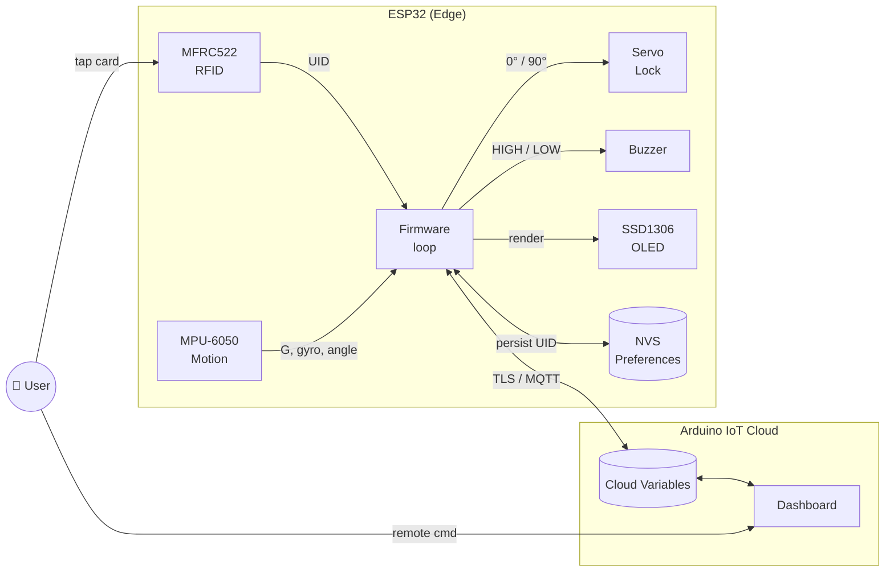
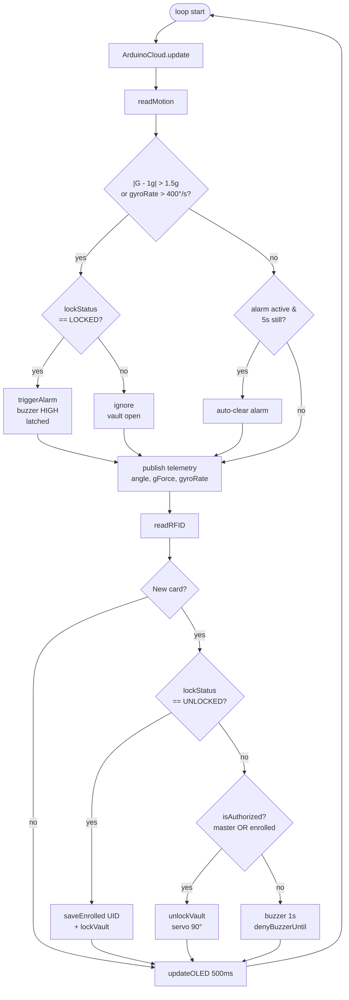
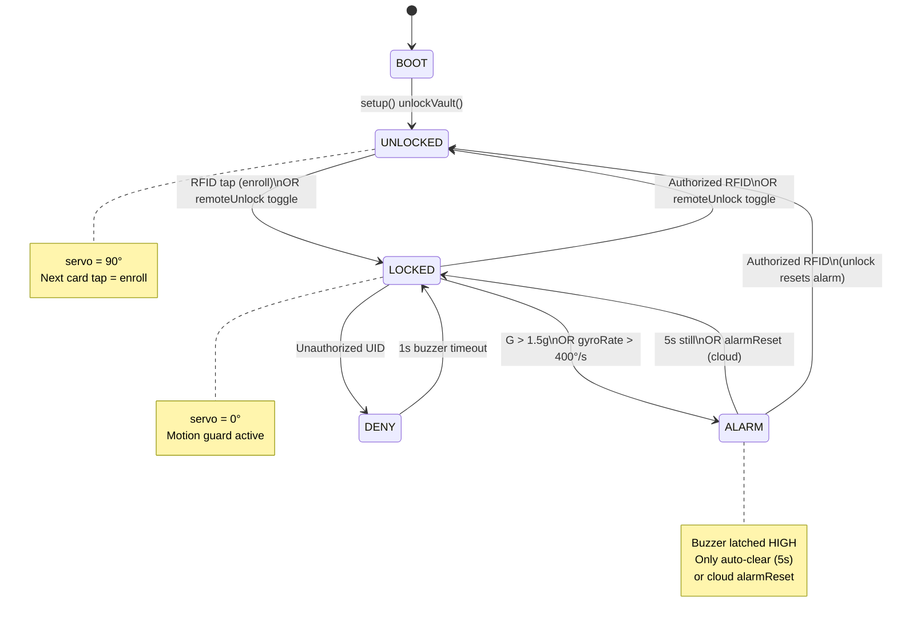

# 🔐 SecureIoT Transit Vault

> ESP32-based portable smart vault with RFID authentication, physical tamper alarm, and remote control via Arduino IoT Cloud.


---

## 📑 Table of Contents

- [Overview](#-overview)
- [Use Cases](#-use-cases)
- [System Architecture](#-system-architecture)
- [Data Flow](#-data-flow)
- [State Diagram](#-state-diagram)
- [Hardware](#-hardware)
- [Pin Connections](#-pin-connections)
- [Technical Specifications](#-technical-specifications)
- [Installation](#-installation)
- [Usage](#-usage)
- [Cloud Variables](#-cloud-variables)
- [Security Note](#-security-note)
- [License](#-license)

---

## 🎯 Overview

**SecureIoT Transit Vault** is an IoT vault firmware that protects the physical integrity of contents during transport and enables remote monitoring. It provides three layers of defense:

| Layer | Mechanism | Component |
|---|---|---|
| 🪪 Identity | RFID UID matching (MASTER + NVS-persisted) | MFRC522 |
| 📐 Physical | Impact & sudden rotation detection | MPU-6050 |
| ☁️ Remote | Cloud unlock / alarm reset / UID enroll | Arduino IoT Cloud (TLS) |

**Addressed IoT vulnerabilities:**

- ❌ Hardcoded single-factor auth → ✅ NVS persist + cloud-side UID enroll
- ❌ Local-only alarm reset (physical attacker can silence it) → ✅ Latching alarm, only cloud `alarmReset` or 5s stillness
- ❌ Exposed sensor data → ✅ Telemetry over Cloud TLS
- ❌ Auth loss on power failure → ✅ Persistent UID via ESP32 NVS (`Preferences`)

---

## 💼 Use Cases

| Scenario | Benefit |
|---|---|
| 🚚 Valuable cargo transport | Impact / tilt events reflected to cloud throughout transit |
| 🏥 Sample / medication transfer | Mechanical stress traced; access controlled by UID |
| 🏠 Smart home safe | RFID + remote unlock; alarm notification on phone |
| 🏭 Industrial field kit box | Authorized technician card + remote supervision |
| 🎒 Personal data / wallet safe | Low cost, open source |

---

## 🏗 System Architecture



---

## 🔄 Data Flow



---

## 🎛 State Diagram



---

## 🔧 Hardware

| Component | Model | Interface |
|---|---|---|
| MCU | ESP32 DOIT DevKit V1 | — |
| RFID | MFRC522 | SPI (custom pins) |
| Motion | MPU-6050 | I2C @ 0x68 |
| Display | SSD1306 128×64 OLED | I2C @ 0x3C |
| Actuator | SG90 / MG90 servo | PWM |
| Alarm | Active buzzer 5V | GPIO |

> ⚠️ **Note:** GPIO23 is faulty on this board. SPI MOSI was redirected to **GPIO32**.

---

## 🔌 Pin Connections

| Peripheral | Signal | ESP32 GPIO |
|---|---|---|
| OLED SSD1306 | SDA | 21 |
| OLED SSD1306 | SCL | 22 |
| MPU-6050 | SDA / SCL (shared) | 21 / 22 |
| RFID MFRC522 | SS | 5 |
| RFID MFRC522 | SCK | 14 |
| RFID MFRC522 | MOSI | 32 |
| RFID MFRC522 | MISO | 25 |
| RFID MFRC522 | RST | 4 |
| Servo | Signal | 13 |
| Buzzer | Signal | 12 |

**Power:** OLED / MPU / RFID = **3V3** · Servo / Buzzer = **5V** · Common GND.

---

## ⚙️ Technical Specifications

| Parameter | Value |
|---|---|
| Dynamic G threshold | `1.5 g` (deviation: `‖a‖ − 1g`) |
| Angular velocity threshold | `400 °/s` (gyro X axis) |
| Angle dead-zone filter | `0.3 °` (gyro drift suppression) |
| Alarm auto-clear duration | `5000 ms` still MPU |
| OLED refresh rate | `500 ms` |
| RFID debounce | `1000 ms` |
| Telemetry publish | `1000 ms` |
| UID persistence | ESP32 NVS — `Preferences(vault, uid)` |
| Auth model | Master UID (compile-time) + 1 enrolled UID (runtime) |
| Cloud transport | Arduino IoT Cloud — MQTT over TLS 1.2 |
| Baseline reset | `lockVault()` call or `statsReset` cloud trigger |
| Servo positions | `0°` = LOCKED · `90°` = OPEN |

---

## 🚀 Installation

### 1. Libraries (Arduino Library Manager)

| Library | Version |
|---|---|
| Adafruit SSD1306 | 2.5.10 |
| Adafruit GFX Library | 1.11.9 |
| MFRC522 | 1.4.10 |
| MPU6050_tockn | 1.0.2 |
| ESP32Servo | 0.13.0 |
| ArduinoIoTCloud | Via Arduino Cloud |
| Arduino_ConnectionHandler | Via Arduino Cloud |

### 2. Clone the repo

```bash
git clone https://github.com/<username>/SecureIoT_Transit_Vault.git
cd SecureIoT_Transit_Vault
```

### 3. Create `arduino_secrets.h`

This file is in `.gitignore` — it is **not included** in the repo. Each developer creates it locally.

Create a new file named `arduino_secrets.h` in the project root:

```cpp
#define SECRET_SSID          "Your-WiFi-Network-Name"
#define SECRET_OPTIONAL_PASS "Your-WiFi-Password"
#define SECRET_DEVICE_KEY    "Arduino-Cloud-Device-Key"
```

**Where to find each value:**

| Define | Source |
|---|---|
| `SECRET_SSID` | Name of the WiFi network to connect to |
| `SECRET_OPTIONAL_PASS` | WiFi password (leave empty `""` for open networks) |
| `SECRET_DEVICE_KEY` | [Arduino Cloud](https://app.arduino.cc/) → Devices → your device → Secret Key |

### 4. Upload with Arduino IDE 2.x

1. **Tools → Board** → *DOIT ESP32 DEVKIT V1*
2. **Tools → Port** → select ESP32 USB port
3. Open `SecureIoT_Transit_Vault.ino`
4. **Upload** (→)

### 5. Update Master UID (optional)

```cpp
// SecureIoT_Transit_Vault.ino line 44
const String MASTER_UID = "B9 2A 2D 40";  // replace with your own card
```

**Reading UID:** Open Serial Monitor at **115200 baud** → tap card → copy the `[RFID] Card UID:` line.

---

## 🕹️ Usage

### Physical (local)

| Action | Result |
|---|---|
| Boot | Vault starts in **UNLOCKED** state |
| Tap card while UNLOCKED | Card is **enrolled** → vault **LOCKS** |
| Tap authorized card while LOCKED | **UNLOCK** + alarm reset |
| Tap unauthorized card while LOCKED | 1-second buzzer → DENY |
| Impact / sudden rotation while LOCKED | **ALARM** (buzzer latched) |
| 5 seconds of stillness | Alarm clears automatically |

### Remote (Arduino IoT Cloud Dashboard)

| Variable | Type | Action |
|---|---|---|
| `remoteUnlock` | bool toggle | Toggles lock state + resets alarm |
| `alarmReset` | bool toggle | Stops latched buzzer |
| `authorizedUidInput` | String | Enter new enrolled UID (while vault is LOCKED) |
| `statsReset` | bool toggle | Resets motion statistics, updates baseline |

**`authorizedUidInput` supported UID formats:**

```
A1B2C3D4
a1:b2:c3:d4
A1 B2 C3 D4
```

4 / 7 / 10 byte (8 / 14 / 20 hex characters) accepted; invalid formats are silently rejected.

---

## ☁️ Cloud Variables

| Variable | Dir | Type | Description |
|---|---|---|---|
| `angle` | R | float | Filtered accelerometer-based X angle (°) |
| `gForce` | R | float | Dynamic impact: `‖a‖ − 1g` |
| `gyroRate` | R | float | Instantaneous angular velocity `|gyro X|` (°/s) |
| `lockStatus` | R | bool | `true` = UNLOCKED |
| `rfidUID` | R | String | Last read card UID |
| `remoteUnlock` | RW | bool | Rising edge → lock toggle |
| `alarmReset` | RW | bool | Rising edge → silence buzzer |
| `authorizedUidInput` | RW | String | Cloud-side card enroll |
| `statsReset` | RW | bool | Reset stats + baseline |
| `shakeAvg` / `shakeMax` | R | float | Shake G average / maximum |
| `tiltAbsAvg` / `tiltAbsMax` | R | float | Absolute tilt average / maximum |
| `tiltRelAvg` / `tiltRelMax` | R | float | Baseline-relative tilt average / maximum |

---

## 🛡️ Security Note

This firmware provides **physical tamper alarm + cloud TLS communication**. It does **not** include on-device cryptographic key storage or ESP32 secure-boot.

The MFRC522 RFID reader is vulnerable to UID cloning when used with common MIFARE Classic cards. It should not be used as the sole line of defense in high-security environments.

**Recommendations for production:**

- Enable ESP32 **flash encryption + secure boot v2**
- Never commit `arduino_secrets.h` to git (already in `.gitignore`)
- Rotate Master UID periodically
- Use encrypted card technologies such as DESFire EV2 / NTAG424 DNA instead of MIFARE Classic

---

## 📜 License

[MIT License](LICENSE) — © 2026 alifuatakyemis
